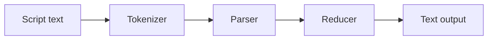

# funcity

A functional language interpreter with text processing.


[](https://www.repostatus.org/#wip)
[](https://opensource.org/licenses/MIT)

|Package|npm|
|:----|:----|
|`funcity`|[](https://www.npmjs.com/package/funcity)|

---

[(Japanese language is here/日本語はこちら)](./README_ja.md)

## What is this?

This is a lightweight functional language processor implemented in TypeScript, featuring syntax extensions for text processing.
It includes a CLI application and a library package containing only the core engine.

funcity can be considered a type of [text template processor](https://en.wikipedia.org/wiki/Template_processor).
For example, entering code like this:

```funcity
Today is {{if weather.sunny}}nice{{else}}bad{{end}}weather.
```

Evaluates the value of the `weather` variable manually bound to the core engine beforehand and generates different text outputs:

```
Today is bad weather.
```

The `if ... else ... end` statements in the text indicate that the script is being executed.
So, you might ask, what makes this a "Functional language"?
Or how is it different from existing text processors?

Let me show you another equivalent example:

```funcity
Today is {{cond weather.sunny 'nice' 'bad'}} weather.
```

This is an example of function application,
inserting the result of applying three arguments to the `cond` function.
The first argument is a conditional expression.

The following code may further interest you:

```funcity
{{
set printWeather (fun w (cond w.sunny 'nice' 'bad'))
}}
Today is {{printWeather weather}} weather.
```

- `fun` defines an anonymous lambda function.
- `set` performs a mutable binding in the current scope.

In other words, funcity is an interpreter that brings the power of functional programming to text template processors, making them easier to handle!

### Features

- A lightweight functional language processor for handling untyped lambda calculus.
  Adopted the simplest possible syntax.
  Additionally, selected the syntax extensions that should be prioritized for text processing.
- All function objects are treated as asynchronous functions.
  You do not need to be aware that they are asynchronous functions when applying them.
- There is also a CLI using the core engine.
  The CLI has both REPL mode and text processing mode.
- The core engine includes a tokenizer, parser, and reducer (interpreter).
- The core engine library is highly independent,
  requiring no dependencies on other libraries or packages.
  It can be easily integrated into your application.
- Parsers and interpreters support both interpreting pure expressions and interpreting full text-processing syntax.
  This means that even when an interpreter for a purely functional language is required,
  it is possible to completely ignore the (somewhat incongruous) syntax of text processing.
- Allows pre-binding of useful standard function implementations.

---

## Installation (CLI)

TODO:

```bash
npm install -D funcity-cli
```

Or, global installation:

```bash
npm install -g funcity-cli
```

## Usage (CLI and REPL basic syntax)

TODO:

---

## Installation (Library)

```bash
npm install funcity
```

## Usage (Library)

The core engine of funcity takes a script string as source code, executes it, and returns a string result.
This flow follows a typical language-processing workflow like the following:



- The tokenizer analyzes the script text and splits it into the words used by funcity.
- The parser analyzes context from the tokens produced by the tokenizer and builds meaningful node structures.
- The reducer evaluates the nodes and performs computation.
  Chaining these steps results in script execution.

### Basic operation

Writing the whole operation in code gives a minimal example like this:

```typescript
const run = async (
  script: string,
  errors: FunCityErrorInfo[] = []
): Promise<string> => {
  // Run the tokenizer
  const blocks: FunCityToken[] = runTokenizer(script, errors);

  // Run the parser
  const nodes: FunCityBlockNode[] = runParser(blocks, errors);

  // Run the reducer
  const variables: FunCityVariables = buildCandidateVariables();
  const results: unknown[] = await runReducer(nodes, variables, errors);

  // Concatenate all results as text
  const text: string = results.join('');

  return text;
};
```

(This code is exposed as a similar function named `runScriptOnce()`.)

- The reducer's output is raw computational results.
  Multiple results may also be obtained.
  Therefore, these are concatenated as strings to produce the final output text.
- If a script does not change once loaded and you want to run only the reducer many times,
  you can run the tokenizer and parser up front, then execute only the reducer for efficient processing.

### Variable binding

The reducer can accept a predefined set of variables as an argument.
If you define (bind) variables in advance, you can reference them inside the script:

```typescript
// buildCandidateVariables() can add arbitrary variables, including standard functions
const variables = buildCandidateVariables(
  {
    foo: 'ABCDE',  // The string can be referenced under the name `foo`
  },
);

// ex: `{{foo}}` ---> ['ABCDE']
const results = await runReducer(nodes, variables, errors);
```

### Binding function objects

Variables can bind not only literal values like strings and numbers, but also arbitrary function objects:

```typescript
// buildCandidateVariables() can add arbitrary variables, including standard functions
const variables = buildCandidateVariables(
  {
    bar: async (n: unknown) => Number(n) * 2,  // Async function
  }
);

// ex: `{{bar 21}}` ---> [42]
const results = await runReducer(nodes, variables, errors);
```

- When specifying function objects, you can pass async functions as shown above.
  The reducer handles asynchronous continuations internally, so any processing including I/O can be implemented.
- While you can explicitly specify the type of a function's arguments, the interpreter does not check this type.
  Therefore, if you write code assuming the specified type, a runtime error may occur when a value of a different type is passed by the script.
  As mentioned above, we recommend always receiving it as `unknown` and checking within the function.

With this variable binding feature, your application features can be referenced inside scripts.
If you expose the scripting capability to users, they can extend functionality however they like.

TODO:

---

## Standard Functions

Standard functions are defined on the object exposed from `standardVariables`,
and are implemented only with features that are available by default and do not depend on external libraries.
For example, there is a `length` function that returns the length of a string or an array (`Iterable` object):

```funcity
{{length 'ABC'}}
```

| Function | Description |
| :--- | :--- |
| `typeof` | Returns the type name. |
| `cond` | If the condition in the first argument is true, returns the second argument; otherwise the third. |
| `toString` | Converts the first argument to a string. |
| `add` | Adds all arguments as numbers. |
| `sub` | Subtracts all arguments as numbers. |
| `mul` | Multiplies all arguments as numbers. |
| `div` | Divides the first argument (as a number) by the second argument. |
| `mod` | Returns the remainder of dividing the first argument (as a number) by the second argument. |
| `equal` | Performs strict equality (`===`). |
| `now` | Returns current UNIX time in milliseconds. |
| `concat` | Concatenates strings and `Iterable` arguments in order. |
| `join` | Uses the first argument as a separator and joins strings from the second argument onward. |
| `trim` | Trims whitespace at both ends of the first argument. |
| `toUpper` | Uppercases the first argument. |
| `toLower` | Lowercases the first argument. |
| `length` | Returns the length of the string/array/`Iterable` in the first argument. |
| `and` | ANDs arguments as booleans (error if no arguments). |
| `or` | ORs arguments as booleans (error if no arguments). |
| `not` | Returns the negation of the first argument as a boolean. |
| `at` | Uses the first argument as an index to fetch an element from the array/`Iterable` in the second argument. |
| `first` | Returns the first element of the array/`Iterable` in the first argument. |
| `last` | Returns the last element of the array/`Iterable` in the first argument. |
| `range` | Creates a sequential array of the second argument length, starting from the first argument value. |
| `sort` | Converts an `Iterable` to an array and sorts with the default order. |
| `reverse` | Reverses an `Iterable` into an array. |
| `map` | Applies the function in the first argument to each element and returns an array. |
| `flatMap` | Expands and concatenates results of the function in the first argument. |
| `filter` | Returns only the elements where the result of the function in the first argument is true. |
| `collect` | Builds an array excluding results that are `null`/`undefined` from the function in the first argument. |
| `reduce` | Folds using the initial value in the first argument and the function in the second argument. |
| `match` | For the second argument, returns an array of matches using the regex in the first argument. |
| `replace` | For the third argument, replaces matches of the regex in the first argument with the second argument. |
| `regex` | Creates a regex object from the pattern in the first argument and the options in the second argument. |
| `bind` | Partially applies the arguments after the first to the function in the first argument. |

### typeof

`typeof` returns the type name of the first argument's instance.
This function is similar to JavaScript's `typeof`, but also performs the following additional checks:

| Type | Type Name |
| :--- | :--- |
| Null | `null` |
| Array | `array` |
| Iterable | `iterable` |

### cond

The `cond` function returns either the value of the second argument or the value of the third argument, depending on the truth value of the first argument:

```funcity
{{cond true ‘OK’ 'NG'}}
```

In regular functions, all arguments are evaluated.

However, this function is special: only one of the second and third arguments is evaluated, depending on the result of the first argument.

### add,mul,and,or

These functions can take multiple arguments:

```funcity
{{add 2 5 4 3 9}}
```

For `and` and `or`, at least one argument is required.

### at,first,last

Extract elements from an array/`Iterable`:

```funcity
{{at 1 [12 34 56]}}
{{first [12 34 56]}}
{{last [12 34 56]}}
```

The index for `at` is zero-based.

### range

Creates a sequential array with a start value and count:

```funcity
{{range 3 5}}
```

The result is an array like `[3 4 5 6 7]`.

### map,flatMap,filter

Pass a function that takes one argument as the first argument. It can be a lambda or a bound variable.
By passing an array-like `Iterable` as the second argument, it runs sequential processing:

```funcity
{{map (fun [x] (mul x 10)) [12 34 56]}}
{{flatMap (fun [x] [(mul x 10) (add x 1)]) [1 2]}}
{{filter (fun [x] (mod x 2)) [1 2 3 4]}}
```

### collect

Filters out `null`/`undefined` and returns an array:

```funcity
{{collect [1 undefined 3 null 4]}}
```

The result is an array like `[1 3 4]`.

### reduce

Specify the initial value as the first argument.
Specify a fold function that takes two arguments as the second argument.
Pass an array-like `Iterable` as the third argument to run the fold:

```funcity
{{reduce 'A' (fun [acc v] (concat acc v)) ['B' 'C' 'D']}}
```

The result is `'ABCD'`.

### regex

Specify the regex pattern string as the first argument.
Specify [regex options (e.g. `'g'` or `'i'`)](https://developer.mozilla.org/en-US/docs/Web/JavaScript/Guide/Regular_expressions#advanced_searching_with_flags) as the second argument.

```funcity
{{set r (regex '[A-Z]' 'gi')}}
```

### match

The regex in the first argument can be a string or a `regex` object.
Specify the string to test as the second argument:

```funcity
{{match (regex '[A-Z]' 'gi') 'Hello World'}}
```

The result is an array like `['H' 'e' 'l' 'l' 'o' 'W' 'o' 'r' 'l' 'd']`.

### replace

The regex in the first argument can be a string or a `regex` object:

```funcity
{{replace 'dog' 'ferret' 'dog is cute'}}
```

The result is `'ferret is cute'`.

### bind

Returns a function with partially applied arguments:

```funcity
{{(bind add 123) 100}}
```

The result is `223`.

---

## TODO

- LSP server.
- `let` immutable binding.
- Dynamic (runime inlined) code generator.

## Note

funcity was separated from the document site generator [mark-the-ripper](https://github.com/kekyo/mark-the-ripper) during its design phase,
as it seemed better suited to function as an independent scripting engine.

Therefore, mark-the-ripper can leverage the power of funcity's functional language.

## License

Under MIT.
