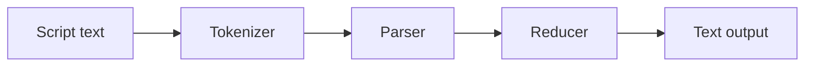

# funcity

A functional language interpreter with text processing, easy embeddable!


[](https://www.repostatus.org/#wip)
[](https://opensource.org/licenses/MIT)

|Package|npm|
|:----|:----|
|`funcity-cli`|[](https://www.npmjs.com/package/funcity-cli)|
|`funcity`|[](https://www.npmjs.com/package/funcity)|

---

[(Japanese language is here/日本語はこちら)](./README_ja.md)

## What is this?

This is a lightweight functional language processor implemented in TypeScript, featuring syntax extensions for text processing.
It includes a CLI application and a library package containing only the core engine.

funcity can be considered a type of [text template processor](https://en.wikipedia.org/wiki/Template_processor).
For example, entering code like this:

```funcity
Today is {{if weather.sunny}}nice{{else}}bad{{end}}weather.
```

Evaluates the value of the `weather` variable manually bound to the core engine beforehand and generates different text outputs:

```
Today is bad weather.
```

The `if ... else ... end` statements in the text indicate that the script is being executed.
So, you might ask, what makes this a "Functional language"?
Or how is it different from existing text processors?

Let me show you another equivalent example:

```funcity
Today is {{cond weather.sunny 'nice' 'bad'}} weather.
```

This is an example of function application,
inserting the result of applying three arguments to the `cond` function.
The first argument is a conditional expression.

The following code may further interest you:

```funcity
{{
set printWeather (fun w (cond w.sunny 'nice' 'bad'))
}}
Today is {{printWeather weather}} weather.
```

- `fun` defines an anonymous lambda function.
- `set` performs a mutable binding in the current scope.

Of course, the beloved Fibonacci sequence can also be computed by defining a recursive function:

```funcity
{{
set fib (fun n \
  (cond (le n 1) \
    n \
    (add (fib (sub n 1)) (fib (sub n 2)))))
}}
Fibonacci (10) = {{fib 10}}
```

Furthermore, you can easily integrate this interpreter into your application:

```typescript
// Input script
const script = "Today is {{cond weather.sunny ‘nice’ 'bad'}} weather.";

// Run the interpreter
const variables = buildCandidateVariables();
const logs: FunCityLogEntry[] = [];
const text = await runScriptOnceToText(script, variables, logs);

// Display the result text
console.log(text);
```

In other words, Funcity is a processing system that brings the power of functional programming to text template processors, enabling seamless integration into applications!

### Features

- A lightweight functional language processor for handling untyped lambda calculus.
  Adopted the simplest possible syntax.
  Additionally, selected the syntax extensions that should be prioritized for text processing.
- All function objects are treated as asynchronous functions.
  You do not need to be aware that they are asynchronous functions when applying them.
- There is also a CLI using the core engine.
  The CLI has both REPL mode and text processing mode.
- The core engine includes a tokenizer, parser, and reducer (interpreter).
- The core engine library is highly independent,
  requiring no dependencies on other libraries or packages.
  It can be easily integrated into your application.
- Parsers and interpreters support both interpreting pure expressions and interpreting full text-processing syntax.
  This means that even when an interpreter for a purely functional language is required,
  it is possible to completely ignore the (somewhat incongruous) syntax of text processing.
- Allows pre-binding of useful standard function implementations.

---

## Installation (CLI)

```bash
npm install -D funcity-cli
```

Or, global installation:

```bash
npm install -g funcity-cli
```

## Usage (CLI and REPL)

funcity CLI provides both REPL mode and script execution mode.

REPL mode lets you enter funcity code interactively and execute it.
Script execution mode reads a funcity script source and prints the result to stdout.

```bash
# Start in REPL mode
$ funcity
$ funcity repl

# Script execution mode (read from stdin)
$ funcity -i -

# Script execution mode (read from a file)
$ funcity -i script.fc

# Script execution mode (explicit, read from stdin)
$ funcity run
```

- If you omit `repl` / `run`, it defaults to `repl` when no options are provided.
- If `--input` or `-i` is specified, it is treated as `run`.
- On startup, the CLI loads `~/.funcityrc` once and executes it before running
  the REPL or script. Use `--no-rc` to skip loading this file.

### REPL mode

Start with `funcity` or `funcity repl`. The prompt is `funcity> `.

The REPL runs code expressions only and ignores text blocks.
This means it behaves like a pure funcity functional language interpreter.

Example using the `add` function and `set` for variable binding:

```bash
$ funcity
funcity> add 1 2
3
funcity> set x 10
funcity> add x 5
15
```

Press `Ctrl+D` to exit.

The REPL has a special variable, `prompt`. Its initial value is defined as `'funcity> '`, which is output as the REPL prompt.
As astute users may have noticed, you can change the prompt using `set`:

```funcity
funcity> set prompt 'number42> '
number42> 
```

### Script execution mode

Script execution mode reads scripts from a file or standard input and processes them as complete scripts, including text blocks.

For example, store the funcity script in a `script.fc` file:

```funcity
{{
set fib (fun n \
  (cond (le n 1) \
    n \
    (add (fib (sub n 1)) (fib (sub n 2)))))
}}
Fibonacci (10) = {{fib 10}}
```

Execute it as follows:

```bash
$ funcity run -i script.fc
```

Alternatively, specifying `-i -` reads from standard input:

```bash
$ echo “Hello {{add 1 2}}” | funcity run -i -
Hello 3
```

---

## funcity Script Syntax

funcity uses a script syntax that extends the functional language with procedural constructs for text formatting.
This section focuses on how to write scripts that interleave text and expressions.

### Basic expressions and text formatting

Here is the shortest possible example:

```funcity
The city is {{'Lisbon'}}.
```

Running it with funcity produces:

```bash
$ echo "The city is {{'Lisbon'}}." | funcity run
The city is Lisbon.
```

Inside the double braces `{{...}}`, you can write a statement or expression.
Besides strings, you can also insert numbers:

```bash
$ echo "This format appeared in {{1965}}." | funcity run
This format appeared in 1965.
```

Because numbers are allowed, you can also compute them:

```bash
$ echo "This format appeared in {{add 1960 5}}." | funcity run
This format appeared in 1965.
```

`add` is one of the standard funcity functions. See the standard functions section for more details.
You can also call JavaScript's `Math` object:

```bash
$ echo "The diagonal of a 1cm square is {{Math.sqrt 2}}cm." | funcity run
The diagonal of a 1cm square is 1.4142135623730951cm.
```

Functions are not limited to numbers. You can pass strings as well:

```bash
$ echo "Because it is a {{concat 'sun' 'flower'}}, it is bright." | funcity run
Because it is a sunflower, it is bright.
```

Some functions take multiple arguments. Since arguments are space-separated, nested expressions should use parentheses to avoid ambiguity:

```bash
$ echo "We counted about {{add (mul 4 10) 2}} birds." | funcity run
We counted about 42 birds.
```

### Basic statements and text formatting

funcity also has a somewhat procedural syntax.
If you know other text processors, you will quickly see how it works:

```bash
$ echo "The label is {{if true}}valid{{else}}invalid{{end}}." | funcity run
The label is valid.
```

The `if` statement evaluates its argument. If the value is not `false`, it outputs everything up to `else`.
Otherwise it outputs everything between `else` and `end`.
Try replacing `true` with `false` and confirm the behavior.

Since that example hardcodes `true`, it is not very interesting.
Let's look at `for` next:

```bash
$ echo "We named them {{for i (range 1 5)}}[cat{{i}}]{{end}}." | funcity run
We named them [cat1][cat2][cat3][cat4][cat5].
```

The `range` function returns a list of numbers from 1 to 5.
`for` iterates that list, assigns each value to `i`, and repeats the body until `end`.

Now nest an `if` inside the `for`:

```bash
$ echo "Odd labels: {{for i (range 1 5)}}{{if (mod i 2)}}[cat{{i}}]{{end}}{{end}}" | funcity run
Odd labels: [cat1][cat3][cat5]
```

You can nest `for` and `if` as needed.

funcity lets you define variables with arbitrary names:

```funcity
Pi is long, so define a variable named pi.
{{
set pi 3.14159265
}}
Now pi is reusable. A circle with radius 10cm has circumference {{mul 2 pi 10}}cm.
```

When writing multi-line code, save it to a file (for example, `sample.fc`) and pass it to funcity:

```bash
$ funcity run -i sample.fc
Pi is long, so define a variable named pi.

Now pi is reusable. A circle with radius 10cm has circumference 62.831853cm.
```

Because a newline is emitted at the point where the braces close, you may see blank lines like the one above.
If that is a problem for your output, pay attention to where you break lines.

Memo: variables can be overwritten later with `set`. In programming terms, they are "mutable", which is not always favored in functional languages.

With these pieces, you can implement the usual fizz-buzz:

```funcity
{{for i (range 1 15)}}{{if (eq (mod i 15) 0)}}FizzBuzz{{else}}{{if (eq (mod i 3) 0)}}Fizz{{else}}{{if (eq (mod i 5) 0)}}Buzz{{else}}{{i}}{{end}}{{end}}{{end}}
{{end}}
```

The line is long only to keep the output layout correct. Executing it yields:

```bash
$ funcity run -i sample.fc
1
2
Fizz
4
Buzz
Fizz
7
8
Fizz
Buzz
11
Fizz
13
14
FizzBuzz
```

`while` is also supported:

```funcity
Let's eat!
{{
set abort true
while abort
set eat (readline 'Do you want BBQ? [y/n]:')
set abort (not (or (eq eat 'y') (eq eat 'Y')))
end
}}
All full.
```

`readline` outputs the argument string as a prompt and waits for input.
The resulting input string is returned and assigned to the `eat` variable.

`abort` stores an abort flag, and based on the input obtained via `readline`, it implements the behavior of “exiting after eating the BBQ.”

Here, we're comparing input using simple ‘y’ or ‘Y’, but using the regular expression function `match` allows for more flexible checks.

### Expression separators and comments

You can separate multiple expressions in three ways:

- Split blocks: `{{...}}{{...}}`
- Newline inside a block: `{{...\n...}}`
- Semicolon inside a block: `{{...;...}}`

Examples:

```funcity
{{set a 1}}{{set b 2}}
Sum: {{add a b}}
```

```funcity
{{
set a 1
set b 2
}}
Sum: {{add a b}}
```

```funcity
{{set a 1; set b 2}}
Sum: {{add a b}}
```

Note: `;` is treated as an expression separator, but it is not allowed inside list expressions (`[...]`).

Conversely, to break a line within an expression, place `\` at the end of the line:

```funcity
{{
set abort (not \
  (or (eq eat 'y') \
  (eq eat 'Y')))
}}
```

Comments are recognized as starting with `//` and continuing to the end of the line:

```funcity
{{
// Save the display string
set label (concat name 'is cool')
}}
```

### Functional language

So far you can already handle most text formatting tasks.
Here we focus on funcity as a functional language.

You can define anonymous functions using lambda syntax:

```bash
$ echo "Define a function that doubles a number: {{fun x (add x x)}}" | funcity run
Define a function that doubles a number: fun<#1>
```

This only creates the function object. To apply it, call it:

```bash
$ echo "Define and apply a doubling function: {{(fun x (add x x)) 21}}" | funcity run
Define and apply a doubling function: 42
```

Inline expressions like this can feel unusual. Instead, bind the function to a variable:

```funcity
{{
set mul2 (fun x (add x x))
}}
Define and apply a doubling function: {{mul2 21}}
```

You can define functions with multiple arguments:

```funcity
{{
set ellipse (fun [a b] (mul Math.PI (mul a b)))
}}
Ellipse area: {{ellipse 2 3}}
```

```bash
$ funcity run -i sample.fc

Ellipse area: 18.84955592153876
```

Define an argument list with `[...]`. The example above uses JavaScript's `Math.PI` to turn the ellipse area formula `pi * a * b` into a function.

Finally, recursion. You can call a bound function from within itself.
The Fibonacci example below binds `fib`, and `fib` refers to itself:

```funcity
{{
set fib (fun n \
  (cond (le n 1) \
    n \
    (add (fib (sub n 1)) (fib (sub n 2)))))
}}
Fibonacci (10) = {{fib 10}}
```

To break long expressions across lines, put `\` at the end of the line.
Because funcity variables are mutable, you can read them freely from inside functions. If a variable is undefined, a runtime error occurs.

Currently, funcity does not perform tail-call optimization, so deep recursion can overflow.

### Escaping string literals

String literals in funcity are wrapped in single quotes `'`. The empty string is `''`.
To use `'` or `\` inside a string, escape them with a backslash.

Supported escape sequences:

- `\n` newline
- `\t` tab
- `\r` carriage return
- `\v` vertical tab
- `\f` form feed
- `\0` NUL
- `\'` single quote
- `\\` backslash

Undefined escape sequences are treated as errors.

Examples:

```bash
$ echo "Newline: {{'A\\nB'}}" | funcity run
Newline: A
B
```

```bash
$ echo "Quote: {{'I\\'m \\\\ ok'}}" | funcity run
Quote: I'm \ ok
```

---

## Installation (Library)

```bash
npm install funcity
```

## Usage (Library)

The core engine of funcity takes a script string as source code, executes it, and returns a string result.
This flow follows a typical language-processing workflow like the following:



- The tokenizer analyzes the script text and splits it into the words used by funcity.
- The parser analyzes context from the tokens produced by the tokenizer and builds meaningful node structures.
- The interpreter (Reducer) interprets and computes each node.
  This chain of operations recursively executes the entire script code.

### Basic operation

Writing the whole operation in code gives a minimal example like this:

```typescript
const run = async (
  script: string,
  logs: FunCityLogEntry[] = []
): Promise<string> => {
  // Run the tokenizer
  const blocks: FunCityToken[] = runTokenizer(script, logs);

  // Run the parser
  const nodes: FunCityBlockNode[] = runParser(blocks, logs);

  // Run the reducer
  const variables: FunCityVariables = buildCandidateVariables();
  const results: unknown[] = await runReducer(nodes, variables, logs);

  // Concatenate all results as text
  const text: string = results.join('');
  return text;
};
```

“The core” of the core engine is truly concentrated in this code:

- The reducer's output is raw computational results.
  Multiple results may also be obtained.
  Therefore, these are concatenated as strings to produce the final output text.
- If a script does not change once loaded and you want to run only the reducer many times,
  you can run the tokenizer and parser up front, then execute only the reducer for efficient processing.
- Errors and warnings are added to `logs`.
  If you want to terminate early due to logs or warnings, you can check whether `logs` contains any entries after each operation completes.
- Even if logs and/or warnings exist, processing can continue to the interpreter.
  The location where the error occurred may have been replaced with an appropriate token node,
  and executing the interpreter using that information will likely not function correctly.
  However, since some structure is preserved, parsing the tokens and nodes may allow for the generation of more appropriate logs.
- Depending on the script's content, reducer processing may not finish (e.g., due to infinite loops).
  Passing an `AbortSignal` as an argument to `runReducer()` allows external interruption of execution.

Note: This code is exposed as a similar function named `runScriptOnce()` and  `runScriptOnceToText()`.
That it actually converts `results` to text using `convertToString()`.

### Executing Only Functional Language Syntax

The previous section demonstrated how to execute Funcity scripts directly. However, you can also parse and execute only the functional language syntax within Funcity.
This allows you to use Funcity purely as a functional language processor when text processing is not required.
This corresponds to the CLI's REPL mode:

```typescript
TODO: Example using runCodeTokenizer, parseExpressions, reduceNode
```

### Bind the value to a variable

The reducer can accept a predefined set of variables as an argument.
If you define (bind) variables in advance, you can reference them inside the script:

```typescript
// buildCandidateVariables() can add arbitrary variables, including standard functions
const variables = buildCandidateVariables(
  {
    foo: 'ABCDE',  // The string can be referenced under the name `foo`
  },
);

// ex: `{{foo}}` ---> ['ABCDE']
const results = await runReducer(nodes, variables, logs);
```

### Bind function objects

Variables can bind not only literal values like strings and numbers, but also arbitrary function objects:

```typescript
// buildCandidateVariables() can add arbitrary variables, including standard functions
const variables = buildCandidateVariables(
  {
    bar: async (n: unknown) => Number(n) * 2,  // Async function
  }
);

// ex: `{{bar 21}}` ---> [42]
const results = await runReducer(nodes, variables, logs);
```

- When specifying function objects, you can pass async functions as shown above.
  The reducer handles asynchronous continuations internally, so any processing including I/O can be implemented.
- While you can explicitly specify the type of a function's arguments, the interpreter does not check this type.
  Therefore, if you write code assuming the specified type, a runtime error may occur when a value of a different type is passed by the script.
  As mentioned above, we recommend always receiving it as `unknown` and checking within the function.

Using this variable definition feature allows application functionality to be referenced within scripts,
enabling users to extend the application and publish a plugin system.

### funcity Functions (Advanced Topics)

A "funcity function" is not a normal JavaScript function object; it can receive nodes obtained from the parser directly as arguments.
You can define one using `makeFunCityFunction()`.

In the example below, the second argument is reduced (evaluated) and returned only when the value passed to the first argument is truthy.
With ordinary functions, all arguments are reduced before they are passed, so a function like this can only be defined as a funcity function:

```typescript
const variables = buildCandidateVariables(
  {
    // funcity function
    baz: makeFunCityFunction(
      async function (  // function keyword required
        this: FunCityFunctionContext, // Access reducer features
        c: FunCityExpressionNode | undefined,    // First-argument node
        n: FunCityExpressionNode | undefined) {  // Second-argument node
        // `c` or `n` is missing
        if (!c || !n) {
          // Record an error
          this.appendError({
            type: 'error',
            description: 'Required arguments',
            range: this.thisNode.range,  // Current function-application node
          });
          // Return undefined due to the error
          return undefined;
        }
        // Only when reduced `c` is truthy
        const cr = await this.reduce(c);
        if (isConditionalTrue(cr)) {
          // Reduce `n` and return it
          return await this.reduce(n);
        }
        // When `c` is falsy
        return -1;
    }),
  }
);

// ex: `{{baz true 5}}` ---> [5]
// ex: `{{baz false 5}}` ---> [-1]   (The expression `5` is not reduced)
const results = await runReducer(nodes, variables, logs);
```

- `FunCityFunctionContext` is an interface for using some interpreter features inside funcity functions.
  It is passed as the JavaScript `this` reference, so you need to use a `function` statement and define `this` as the first argument.
  Note that you can obtain and operate on this context not only in funcity functions but also in normal functions.
- `this.reduce()` evaluates (reduces) the specified argument node.
  For example, if the node references a variable, the value of that variable is returned.
  If the node indicates function application, that computation is executed and the result is returned.
- As with normal functions, arguments might not be passed (you don't know at runtime whether the required number of arguments was provided),
  so you should assume they can be `undefined`.
- In this example we return `undefined` when an error is recorded, but this is not required; you can return any value.
  If you return a meaningful value, evaluation continues using that value
  (processing usually continues even if logs are recorded).

---

## Standard Functions

Standard functions are implemented using only features that are publicly available from `standardVariables` or included in the functions returned by `buildCandidateVariables()`,
and that are standardly usable and independent of external libraries.

For example, there is a `length` standard function that returns the length of a string or an array (`Iterable` object):

```funcity
{{length 'ABC'}}
```

The following are the standard functions:

| Function/Object | Description |
| :--- | :--- |
| `typeof` | Returns the type name. |
| `cond` | If the condition in the first argument is true, returns the second argument; otherwise the third. |
| `toString` | Converts the arguments to a string. |
| `toBoolean` | Converts the first argument to a boolean. |
| `toNumber` | Converts the first argument to a number. |
| `toBigInt` | Converts the first argument to a bigint. |
| `add` | Adds all arguments as numbers. |
| `sub` | Subtracts all arguments as numbers. |
| `mul` | Multiplies all arguments as numbers. |
| `div` | Divides the first argument (as a number) by the second argument. |
| `mod` | Returns the remainder of dividing the first argument (as a number) by the second argument. |
| `eq` | Performs strict equality (`===`). |
| `ne` | Performs strict inequality (`!==`). |
| `lt` | Returns true if the first argument is less than the second. |
| `gt` | Returns true if the first argument is greater than the second. |
| `le` | Returns true if the first argument is less than or equal to the second. |
| `ge` | Returns true if the first argument is greater than or equal to the second. |
| `now` | Returns current date time in `Date` object. |
| `concat` | Concatenates strings and `Iterable` arguments in order. |
| `join` | Uses the first argument as a separator and joins strings from the second argument onward. |
| `trim` | Trims whitespace at both ends of the first argument. |
| `toUpper` | Uppercases the first argument. |
| `toLower` | Lowercases the first argument. |
| `length` | Returns the length of the string/array/`Iterable` in the first argument. |
| `and` | ANDs arguments as booleans. |
| `or` | ORs arguments as booleans. |
| `not` | Returns the negation of the first argument as a boolean. |
| `at` | Uses the first argument as an index to fetch an element from the array/`Iterable` in the second argument. |
| `first` | Returns the first element of the array/`Iterable` in the first argument. |
| `last` | Returns the last element of the array/`Iterable` in the first argument. |
| `range` | Creates a sequential array of the second argument length, starting from the first argument value. |
| `sort` | Converts an `Iterable` to an array and sorts with the default order. |
| `reverse` | Reverses an `Iterable` into an array. |
| `map` | Applies the function in the first argument to each element and returns an array. |
| `flatMap` | Expands and concatenates results of the function in the first argument. |
| `filter` | Returns only the elements where the result of the function in the first argument is true. |
| `collect` | Builds an array excluding results that are `null`/`undefined` from the function in the first argument. |
| `reduce` | Folds using the initial value in the first argument and the function in the second argument. |
| `match` | For the second argument, returns an array of matches using the regex in the first argument. |
| `replace` | For the third argument, replaces matches of the regex in the first argument with the second argument. |
| `regex` | Creates a regex object from the pattern in the first argument and the options in the second argument. |
| `bind` | Partially applies the arguments after the first to the function in the first argument. |
| `url` | Creates a URL object from the first argument and optional base in the second argument. |
| `fetch` | Performs a fetch using the `fetch` API. |
| `fetchText` | Fetches and returns `response.text()`. |
| `fetchJson` | Fetches and returns `response.json()`. |
| `fetchBlob` | Fetches and returns `response.blob()`. |
| `delay` | Resolves after the specified milliseconds. |

Additionally, while not strictly functions, the following symbol names are also included as standard functions:

| Symbol name | Description |
| :--- | :--- |
| `true` | JavaScript `true` value |
| `false` | JavaScript `false` value |
| `undefined` | JavaScript `undefined` value |
| `null` | JavaScript `null` value |

### typeof

`typeof` returns the type name of the first argument's instance.
This function is similar to JavaScript's `typeof`, but also performs the following additional checks:

| Type | Type Name |
| :--- | :--- |
| Null | `null` |
| Array | `array` |
| Iterable | `iterable` |

### cond

The `cond` function returns either the value of the second argument or the value of the third argument, depending on the truth value of the first argument:

```funcity
{{cond true ‘OK’ 'NG'}}
```

In regular functions, all arguments are evaluated.
However, this function is special ("funcity function"): only one of the second and third arguments is evaluated, depending on the result of the first argument.

### toString,toBoolean,toNumber,toBigInt

These functions convert the first argument to a string, boolean, number, or bigint.

```funcity
{{toString 123 'ABC'}}
{{toBoolean 0}}
{{toNumber '123'}}
{{toBigInt '9007199254740993'}}
```

- `toString` converts each argument group into a string and concatenates them with commas. Stringification follows its own pretty-printing rules.
- `toBoolean` follows funcity's conditional semantics: `null`/`undefined` are false, `0`/`0n` are false, and all other values are true.
- `toNumber` uses JavaScript's `Number(...)`, and `toBigInt` uses `BigInt(...)`.
- When `toBigInt` receives a non-primitive type, it performs the same string conversion as `toString` before converting to `BigInt`.

### add,mul,and,or

These functions can take multiple arguments:

```funcity
{{add 2 5 4 3 9}}
```

For `and` and `or`, at least one argument is required.
They evaluate left-to-right and stop once the result is determined (first false for `and`, first true for `or`. They are "funcity function").

### at,first,last

Extract elements from an array/`Iterable`:

```funcity
{{at 1 [12 34 56]}}
{{first [12 34 56]}}
{{last [12 34 56]}}
```

The index for `at` is zero-based.

### range

Creates a sequential array with a start value and count:

```funcity
{{range 3 5}}
```

The result is an array like `[3 4 5 6 7]`.

### map,flatMap,filter

Pass a function that takes one argument as the first argument. It can be a lambda or a bound variable.
By passing an array-like `Iterable` as the second argument, it runs sequential processing:

```funcity
{{map (fun [x] (mul x 10)) [12 34 56]}}
{{flatMap (fun [x] [(mul x 10) (add x 1)]) [1 2]}}
{{filter (fun [x] (mod x 2)) [1 2 3 4]}}
```

### collect

Filters out `null`/`undefined` and returns an array:

```funcity
{{collect [1 undefined 3 null 4]}}
```

The result is an array like `[1 3 4]`.

### reduce

Specify the initial value as the first argument.
Specify a fold function that takes two arguments as the second argument.
Pass an array-like `Iterable` as the third argument to run the fold:

```funcity
{{reduce 'A' (fun [acc v] (concat acc v)) ['B' 'C' 'D']}}
```

The result is `'ABCD'`.

### regex

Specify the regex pattern string as the first argument.
Specify [regex options (e.g. `'g'` or `'i'`)](https://developer.mozilla.org/en-US/docs/Web/JavaScript/Guide/Regular_expressions#advanced_searching_with_flags) as the second argument.

```funcity
{{set r (regex '[A-Z]' 'gi')}}
```

### match

The regex in the first argument can be a string or a `regex` object.
Specify the string to test as the second argument:

```funcity
{{match (regex '[A-Z]' 'gi') 'Hello World'}}
```

The result is an array like `['H' 'e' 'l' 'l' 'o' 'W' 'o' 'r' 'l' 'd']`.

### replace

The regex in the first argument can be a string or a `regex` object:

```funcity
{{replace 'dog' 'ferret' 'dog is cute'}}
```

The result is `'ferret is cute'`.

### bind

Returns a function with partially applied arguments:

```funcity
{{(bind add 123) 100}}
```

The result is `223`.

Be aware that this is different from variable binding, despite the similar-sounding name.
This function is nearly equivalent to `bind()` for function objects in JavaScript.

### url

Creates a URL object using the first argument and an optional base URL in the second argument:

```funcity
{{set u (url '/path' 'https://example.com/base/')}}
```

The result is a `URL` object that represents `https://example.com/base/path`.

### delay

Resolves after the specified milliseconds (optional second argument is returned):

```funcity
{{delay 200}}
```

### objectVariables

`objectVariables` exposes JavaScript built-in objects for binding:

| Object | Description |
| :--- | :--- |
| `Object` | `Object` object. |
| `Function` | `Function` object. |
| `Array` | `Array` object. |
| `String` | `String` object. |
| `Number` | `Number` object. |
| `BigInt` | `BigInt` object. |
| `Boolean` | `Boolean` object. |
| `Symbol` | `Symbol` object. |
| `Math` | `Math` object. |
| `ArrayBuffer` | `ArrayBuffer` object. |
| `Date` | `Date` object. |
| `Intl` | `Intl` object. |
| `JSON` | `JSON` object. |
| `Map` | `Map` object. |
| `Set` | `Set` object. |
| `Promise` | `Promise` object. |
| `RegExp` | `RegExp` object. |
| `WeakMap` | `WeakMap` object. |
| `WeakSet` | `WeakSet` object. |
| `DaReflectte` | `Reflect` object. |
| `Error` | `Error` object. |

```typescript
import { buildCandidateVariables, objectVariables } from 'funcity';

const variables = buildCandidateVariables(objectVariables);
```

For example:

```funcity
{{Math.sqrt 2}}
{{Date '2025/2/23'}}
```

Note: As an important restriction of funcity, if an object has a constructor, you cannot call the object as a function object.
For example, the following expressions distinguished in JavaScript: `new Date(‘2025/2/23’)`, `Date(‘2025/2/23’)`,
are always interpreted as `new Date(‘2025/2/23’)` when written as `Date ‘2025/2/23’` in funcity syntax.

CLI includes `objectVariables` by default.

### fetchVariables

`fetchVariables` exposes the JavaScript `fetch` API for binding:

| Function | Description |
| :--- | :--- |
| `fetch` | Accesses a web server using the `fetch` API. |
| `fetchText` | Returns the result of `response.text()`. |
| `fetchJson` | Returns the result of `response.json()`. |
| `fetchBlob` | Returns the result of `response.blob()`. |

```typescript
import { buildCandidateVariables, fetchVariables } from ‘funcity’;

// Enable the fetch API
const variables = buildCandidateVariables(fetchVariables);

// ...
```

`fetch` returns a response object using the global `fetch`. `fetchText`, `fetchJson` and `fetchBlob` are convenience wrappers:

```funcity
{{fetchText 'data:text/plain,hello'}}
{{fetchJson 'data:application/json,%7B%22ok%22%3Atrue%7D'}}
```

CLI includes `fetchVariables` by default.

### nodeJsVariables

`nodeJsVariables` exposes a `readline` function for reading a single line from
stdin (optional prompt). Import it from the Node-only entry to avoid pulling
Node built-ins into projects that do not use them:

```typescript
import { buildCandidateVariables } from 'funcity';
import { nodeJsVariables } from 'funcity/node';

const variables = buildCandidateVariables(nodeJsVariables);

// ...
```

For example:

```funcity
{{set persons (toNumber (readline 'How many people? '))}}
```

Additionally, `createRequireFunction` generates a Node.js `require` function that resolves modules relative to a specified directory.
Making this function available allows scripts to dynamically load NPM modules.

When `acceptModules` argument is specified, module access is restricted to that allowlist.
Modules must still be either Node.js default modules or located within the `node_modules/` directory of the specified directory:

```typescript
import { buildCandidateVariables } from 'funcity';
import { createRequireFunction } from 'funcity/node';

const _require = createRequireFunction(
  '/path/to/script/dir',  // If not specified, use `process.cwd()`
  ['fs', 'lodash']        // `acceptModules`
);

const variables = {
  require: _require,
};

// ...
```

For example:

```funcity
{{
set fs (require 'fs/promises')
fs.readFile '/foo/bar/text' 'utf-8'
}}
```

`createRequireFunction` creates a Node.js `require` function bound to a base
directory. Import it from the Node-only entry to avoid pulling Node built-ins
into projects that do not use them:

```typescript
import { buildCandidateVariables } from 'funcity';
import { createRequireFunction } from 'funcity/node';

const require = createRequireFunction('/path/to/script/dir', ['fs', 'lodash']);
// const require = createRequireFunction(); // defaults to process.cwd()

const variables = buildCandidateVariables({ require });

// ...
```

For example:

```funcity
{{set fs (require 'fs')}}
{{fs.readFile './data.txt' 'utf-8'}}
```

When `acceptModules` is provided, only the listed module names are allowed.
Package subpaths (such as `lodash/fp` or `fs/promises`) are permitted when the
base module name is listed. Relative or absolute specifiers must be listed
explicitly if you want to allow them.

CLI includes both `readline` and `require` by default.

### Other

If you understand this far, you should also understand what the following code achieves in the browser.
Therefore, please exercise caution when exposing functionality like the following.
At the same time, you should see how funcity protects the host environment from scripts.
Simply put, you just need to prevent dangerous definitions from being accessible.

```typescript
const candidateVariables = buildCandidateVariables(
  {
    window,
    document,
  }
);
```

---

## TODO

- LSP server.
- Dynamic (runime inlined) code generator.

## Note

funcity was separated from the document site generator [mark-the-ripper](https://github.com/kekyo/mark-the-ripper) during its design phase,
as it seemed better suited to function as an independent scripting engine.

Therefore, mark-the-ripper can leverage the power of funcity's functional language.

## License

Under MIT.
