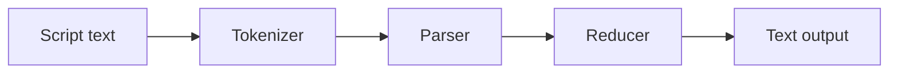

# funcity

テキスト処理機能を備え容易に組み込むことができる、関数型言語インタープリタ


[](https://www.repostatus.org/#wip)
[](https://opensource.org/licenses/MIT)

|Package|npm|
|:----|:----|
|`funcity-cli`|[](https://www.npmjs.com/package/funcity-cli)|
|`funcity`|[](https://www.npmjs.com/package/funcity)|

---

[(English language is here)](./README.md)

## これは何?

これは、TypeScriptで実装された軽量な関数型言語処理系で、テキスト処理のための構文拡張機能を備えています。
CLIアプリケーションと、コアエンジンのみを含むライブラリパッケージが含まれています。

funcityは、[テキストテンプレートプロセッサ](https://en.wikipedia.org/wiki/Template_processor)の一種と捉えることが出来ます。
例えば、次のようなコードを入力すると:

```funcity
Today is {{if weather.sunny}}nice{{else}}bad{{end}} weather.
```

事前にコアエンジンに手動でバインドされた`weather`変数の値を評価し、異なるテキスト出力を生成します:

```
Today is bad weather.
```

テキスト中に記述された `if ... else ... end` によって、スクリプトが実行されていることはわかります。
しかし、これがなぜ「関数型言語」と言えるのでしょうか?
あるいは、他のテキストプロセッサとどう違うのでしょう?

別の同等の例を示しましょう：

```funcity
Today is {{cond weather.sunny 'nice' 'bad'}} weather.
```

これは関数適用の一例であり、`cond` 関数に3つの引数を適用した結果を挿入します。最初の引数は条件式です。

以下のコードも興味深いかも知れません:

```funcity
{{
set printWeather (fun w (cond w.sunny 'nice' 'bad'))
}}
Today is {{printWeather weather}} weather.
```

- `fun` は無名ラムダ関数を定義します。
- `set` は現在のスコープで、ミュータブルバインディングを実行します。

みんな大好きフィボナッチ数列も、もちろん再帰関数を定義して計算できます:

```funcity
{{
set fib (fun n \
  (cond (le n 1) \
    n \
    (add (fib (sub n 1)) (fib (sub n 2)))))
}}
Fibonacci (10) = {{fib 10}}
```

更に、このインタープリタを、あなたのアプリケーションに簡単に組み込むことが出来ます:

```typescript
// 入力スクリプト
const script = "Today is {{cond weather.sunny 'nice' 'bad'}} weather.";

// インタープリタを実行
const variables = buildCandidateVariables();
const logs: FunCityLogEntry[] = [];
const text = await runScriptOnceToText(script, variables, logs);

// 結果の表示
console.log(text);
```

つまり、テキストテンプレートプロセッサに関数型言語のパワーを持ち込み、
簡単にアプリケーションへの組み込む事ができる処理系が、funcityです!

### 特徴

- 型なしラムダ計算を扱う、軽量な関数型言語プロセッサです。
  可能な限りシンプルな構文を採用しています。
  さらに、テキスト処理において優先すべき構文拡張を採用しています。
- すべての関数オブジェクトは非同期関数として扱われます。
  あなたは、関数適用時に非同期関数であることを意識する必要はありません。
- コアエンジンを利用したCLIも存在します。
  CLIは、REPLモードとテキスト処理モードの両方を備えています。
- コアエンジンには、トークナイザー、パーサー、インタープリタを含みます。
- コアエンジンライブラリは高い独立性を持ち、他のライブラリやパッケージに依存していません。
  あなたのアプリケーションへ、容易に組み込むことが出来ます。
- パーサーとインタープリタは、純粋な式を解釈させる場合と、完全なテキストプロセッシング構文を解釈させる場合の両方に対応しています。
  つまり、純粋な関数型言語のインタープリタが必要な場合においても、テキストプロセッシングの（不調和気味な）構文を完全に無視させることが可能です。
- 有用な標準関数実装をあらかじめバインド可能。

---

## パッケージインストール (CLI)

```bash
npm install -D funcity-cli
```

または、グローバルにインストールするなら:

```bash
npm install -g funcity-cli
```

## 使い方 (CLI and REPL)

funcityのCLIは、REPLモードとスクリプト実行モードを提供します。

REPLモードは、対話的にfuncityのコードを入力して実行できます。
スクリプト実行モードは、funcityのスクリプトソースコードを入力して結果を標準出力に表示します。

```bash
# REPLモードで起動
$ funcity
$ funcity repl

# スクリプト実行モード（標準入力から読み取ってスクリプト実行）
$ funcity -i -

# スクリプト実行モード（指定したファイルから読み取ってスクリプト実行）
$ funcity -i script.fc

# スクリプト実行モード（明示的に指定。標準入力から読み取ってスクリプト実行）
$ funcity run
```

- コマンド `repl` / `run` を指定しない場合、オプションがなければ `repl` として扱われます。
- `--input` または `-i` が指定されている場合は `run` として扱われます。

### REPLモード

`funcity` または `funcity repl` で開始します。`funcity> ` が入力プロンプトです。

REPLはコード式専用で動作し、テキストブロックは無視されます。
したがって、funcityの関数型言語インタープリタ実行のみを抜き出したように処理されます。

以下は、 `add` 関数や `set` を使用した変数への値の設定（変数束縛）を実行した例です:

```bash
$ funcity
funcity> add 1 2
3
funcity> set x 10
funcity> add x 5
15
```

終了するには `Ctrl+D` を入力します。

REPLには特殊な変数、 `prompt` が存在します。この値は初期状態で `'funcity> '` と定義されていて、これがREPLのプロンプトとして出力されます。
聡明なユーザーはお気づきと思われますが、 `set` を使ってプロンプトを変更できます:

```funcity
funcity> set prompt 'number42> '
number42> 
```

### スクリプト実行モード

スクリプト実行モードは、ファイルまたは標準入力からスクリプトを読み込み、
テキストブロックを含めた完全なスクリプトとして処理します。

例えば、`script.fc` ファイルに、funcityスクリプトを格納しておき:

```funcity
{{
set fib (fun n \
  (cond (le n 1) \
    n \
    (add (fib (sub n 1)) (fib (sub n 2)))))
}}
Fibonacci (10) = {{fib 10}}
```

以下のように実行します:

```bash
$ funcity run -i script.fc
```

あるいは、 `-i -` を指定すると標準入力から読み込むので:

```bash
$ echo "Hello {{add 1 2}}" | funcity run -i -
Hello 3
```

---

## funcityスクリプト構文

TODO:

---

## パッケージインストール (ライブラリ)

```bash
npm install funcity
```

## 使い方 (ライブラリ)

funcityのコアエンジンは、ソースコードとなるスクリプト文字列を受け取り、それを実行し、結果として文字列を受け取ります。
この一連の流れは、以下のようなプログラム言語処理系の典型的なワークフローで実現されます:



- トークナイザーは、スクリプトテキストを解析して、funcityで使われる単語に分解する処理を行います。
- パーサーは、トークナイザーが分解したトークンから文脈を解析し、意味のあるノードデータ構造を構築します。
- インタープリタ(Reducer)は、各ノードを解釈して計算を行います。これが再帰的に連鎖することにより、結果的にスクリプトコード全体を実行することになります。

### 基本的な操作

一連の操作をコードで記述すると、以下のような最小の例となります:

```typescript
const run = async (
  script: string,
  logs: FunCityLogEntry[] = []
): Promise<string> => {
  // トークナイザーの実行
  const blocks: FunCityToken[] = runTokenizer(script, logs);

  // パーサーの実行
  const nodes: FunCityBlockNode[] = runParser(blocks, logs);

  // インタープリタの実行
  const variables: FunCityVariables = buildCandidateVariables();
  const results: unknown[] = await runReducer(nodes, variables, logs);

  // すべての結果をテキストとして結合
  const text: string = results.join('');
  return text;
};
```

「コアエンジンの中枢」は、正にこのコードに集約されていると言っていいでしょう:

- インタープリタの出力は、生の計算結果です。また、複数の結果が得られる可能性があります。したがって、これらを文字列として結合して、最終的な出力テキストを得ます。
- スクリプトが一度読み込んだら変更されず、何度もインタープリタ実行だけを行いたい場合は、
  トークナイザーとパーサーの実行までを事前に行っておき、インタープリタだけ実行するようにすれば、効率よく処理できます。
- エラーやウォーニングは、 `logs` に追加されます。
  もし、エラーやウォーニングで早期に停止させたいなら、各処理が終了した時点で `logs` に記録があるかどうかを調べることができます。
- エラーがウォーニングが存在しても、インタープリタまで処理を続行できます。
  エラーが存在した箇所は、適当なトークン・ノードに置き換えられている可能性があり、それらの情報を使用してインタープリタを実行すると、正しく動作しない可能性が高いです。
  しかし、ある程度の構造が維持されるので、トークンやノードを解析して、より適切なエラーを生成出来るかもしれません。
- スクリプトの内容によっては、インタープリタの処理が完了しない可能性があります（例えば、無限ループなど）。
  `runReducer()` の引数に、`AbortSignal`を渡すことで、外部から実行を中断させることができます。

注意: このコードは、同様の関数が `runScriptOnce()`, `runScriptOnceToText()` として公開されています。
実際には `results` を、`convertToString()` を使用してテキスト化していることに注意してください。　

### 関数型言語構文のみを実行する

前節では、funcityスクリプトをそのまま実行する方法を示しましたが、funcityの関数型言語構文のみを解析して実行させることも出来ます。
テキストプロセッシングを必要としない場合に、funcityを純粋に関数型言語処理系として使用します。
CLIのREPLモードに相当します:

TODO: runCodeTokenizer, parseExpressions, reduceNodeを使って実行する例

### 値を変数にバインド

インタープリタは、引数に定義済みの変数群を渡すことができます。
あらかじめ変数を定義（バインド）しておけば、スクリプト内でこれを参照することができます:

```typescript
// buildCandidateVariables()は、標準関数を含めて任意の変数群を追加できる
const variables = buildCandidateVariables(
  {
    foo: 'ABCDE',  // `foo`という名前で文字列が参照できる
  },
);

// 例: `{{foo}}` ---> ['ABCDE']
const results = await runReducer(nodes, variables, logs);
```

### 関数オブジェクトのバインド

変数は、文字列や数値などのリテラル値だけではなく、任意の関数オブジェクトもバインドできます:

```typescript
// buildCandidateVariables()は、標準関数を含めて任意の変数群を追加できる
const variables = buildCandidateVariables(
  {
    bar: async (n: unknown) => Number(n) * 2,  // (非同期関数)
  }
);

// 例: `{{bar 21}}` ---> [42]
const results = await runReducer(nodes, variables, logs);
```

- 関数オブジェクトを指定する場合は、上記のように非同期関数を渡すことができます。
  これにより、インタープリタが内部で適切に非同期関数の遅延継続を行うので、I/O操作を含むどのような処理でも実現できます。
- 関数の引数の型を明示的に指定することもできますが、インタープリタはこの型を検査しません。
  したがって、指定した型を前提にコードを記述すると、スクリプトによって異なる型の値が渡された時に実行時エラーが発生するかもしれません。
  上記のように、常に`unknown`として受け取り、関数内で判定することをおすすめします。

この変数定義機能を使用すれば、アプリケーションの機能をスクリプト内で参照できるようになるため、
ユーザーがアプリケーションを拡張出来る、プラグインシステムを公開できることになります。

### funcity関数 (高度なトピック)

funcity関数とは、通常のJavaScript関数オブジェクトではなく、パーサーから得られたノードを直接引数で受け取ることが出来る関数です。
これは、 `makeFunCityFunction()` を使用して定義できます。

以下の例では、第1引数に渡された値が真の場合のみ、第2引数を評価して返します。
通常の関数では、引数はすべて評価されてから渡されるため、このような関数はfuncity関数でのみ定義できます:

```typescript
const variables = buildCandidateVariables(
  {
    // funcity関数
    baz: makeFunCityFunction(
      async function (  // function文が必要
        this: FunCityFunctionContext, // インタープリタの機能にアクセスする
        c: FunCityExpressionNode | undefined,    // 第1引数のノード
        n: FunCityExpressionNode | undefined) {  // 第2引数のノード
        // cとnが両方ともに渡されていない
        if (!c || !n) {
          // エラーを記録
          this.appendError({
            type: 'error',
            description: 'Required arguments',
            range: this.thisNode.range,  // 現在の関数適用ノード
          });
          // エラーなのでundefinedを返す
          return undefined;
        }
        // cを評価し、真の場合のみ
        const cr = await this.reduce(c);
        if (isConditionalTrue(cr)) {
          // nを評価して返す
          return await this.reduce(n);
        }
        // cが偽の場合
        return -1;
    }),
  }
);

// 例: `{{baz true 5}}` ---> [5]
// 例: `{{baz false 5}}` ---> [-1]   (`5`の式の評価は行われない)
const results = await runReducer(nodes, variables, logs);
```

- `FunCityFunctionContext` は、インタープリタの一部の機能をfuncity関数内で使用するためのインターフェイスです。
  これは JavaScript `this` 参照として渡されれるため、 `function` 文を使用してかつ第1引数に `this` を定義する必要があります。
  なお、これはfuncity関数だけでなく、通常の関数でも取得して操作できます。
- `this.reduce()` は、指定された引数のノードを評価（計算）します。
  例えば、そのノードが変数を参照している場合は、その変数の値が返されます。
  ノードが関数適用を示していれば、その計算が実行され、結果が返されます。
- 通常の関数と同様に、引数が渡されていない（必要な個数の引数が渡されているかどうかは、実行時までわからない）可能性があるため、
  `undefined` であることを想定する必要があります。
- エラーを記録した場合に `undefined` を返していますが、これは必須事項ではなく、任意の値を返すことが出来ます。
  意味のある値を返した場合は、その値を使用して引き続き計算が行われます
  （通常、エラーが記録されても処理は継続します）。

---

## 標準関数

標準関数は、`standardVariables` から公開されるオブジェクトや、 `buildCandidateVariables()` が含める関数群で、
標準的に使用可能でかつ外部ライブラリに依存しない機能のみを使用して実装されています。

例えば、文字列や配列（`Iterable`オブジェクト）の文字列や要素数を取得する `length` 標準関数があります:

```funcity
{{length 'ABC'}}
```

以下に標準関数群を示します:

| 関数/オブジェクト | 説明 |
| :--- | :--- |
| `typeof` | 第1引数に指定されたインスタンスの型名を返します。 |
| `cond` | 第1引数の条件が真なら第2引数、偽なら第3引数を返します。 |
| `toString` | 引数群を文字列に変換します。 |
| `toBoolean` | 第1引数を真偽値に変換します。 |
| `toNumber` | 第1引数を数値に変換します。 |
| `toBigInt` | 第1引数をBigIntに変換します。 |
| `add` | 引数群を数値として加算します。 |
| `sub` | 引数群を数値として減算します。 |
| `mul` | 引数群を数値として乗算します。 |
| `div` | 第1引数を数値として第2引数で除算します。 |
| `mod` | 第1引数を数値として第2引数で除算した剰余を求めます。 |
| `eq` | 厳密比較（`===`）します。 |
| `ne` | 厳密比較で不一致（`!==`）を返します。 |
| `lt` | 第1引数が第2引数より小さい場合に真を返します。 |
| `gt` | 第1引数が第2引数より大きい場合に真を返します。 |
| `le` | 第1引数が第2引数以下の場合に真を返します。 |
| `ge` | 第1引数が第2引数以上の場合に真を返します。 |
| `now` | 現在時刻のUNIXミリ秒を返します。 |
| `concat` | 引数群の文字列や`Iterable`を順に連結します。 |
| `join` | 第1引数を区切り文字として、第2引数以降の文字列を結合します。 |
| `trim` | 第1引数の文字列の前後の空白を削除します。 |
| `toUpper` | 第1引数の文字列を大文字化します。 |
| `toLower` | 第1引数の文字列を小文字化します。 |
| `length` | 第1引数の文字列/配列/`Iterable`の長さを返します。 |
| `and` | 引数群を真偽値としてANDします。 |
| `or` | 引数群を真偽値としてORします。 |
| `not` | 第1引数を真偽値として否定を返します。 |
| `at` | 第1引数のインデックスで、第2引数の配列/`Iterable`から要素を取得します。 |
| `first` | 第1引数の配列/`Iterable`の先頭要素を返します。 |
| `last` | 第1引数の配列/`Iterable`の末尾要素を返します。 |
| `range` | 第1引数の数値から、第2引数個の連番配列を作ります。 |
| `sort` | `Iterable`を配列化し、既定順序でソートします。 |
| `reverse` | `Iterable`を逆順の配列にします。 |
| `map` | 第1引数の関数を、各要素に適用して配列を返します。 |
| `flatMap` | 第1引数の関数の結果を展開して結合します。 |
| `filter` | 第1引数の関数の結果が真の要素だけ返します。 |
| `collect` | 第1引数の関数の結果が`null`/`undefined`の場合を除外して配列化します。 |
| `reduce` | 第1引数の初期値と、第2引数の関数で畳み込みます。 |
| `match` | 第2引数について、第1引数の正規表現でマッチした結果を配列で返します。 |
| `replace` | 第3引数について、第1引数の正規表現でマッチした結果を第2引数で置換します。 |
| `regex` | 第1引数の正規表現と第2引数のオプションで、正規表現オブジェクトを生成します。 |
| `bind` | 第1引数の関数に、第2引数以降の引数を部分適用します。 |
| `url` | 第1引数と第2引数（任意）のベースURLからURLオブジェクトを生成します。 |
| `delay` | 指定ミリ秒後に解決します。 |
| `math` | `Math` オブジェクト |

### typeof

`typeof` は、第1引数のインスタンスの型名を返します。
この関数は、JavaScriptの`typeof`に近いですが、以下の追加の判断も行います:

| 型 | 型名 |
| :--- | :--- |
| Null | `null` |
| 配列 | `array` |
| 列挙可能型 | `iterable` |

### cond

`cond`関数は、第1引数の真偽に応じて、第2引数の値、または第3引数の値を返します:

```funcity
{{cond true 'OK' 'NG'}}
```

通常の関数は、引数の式がすべて評価されます。
しかしこの関数は特殊(funcity関数)で、第2第3引数は、第1引数の結果でどちらかだけが評価されます。

### toString,toBoolean,toNumber,toBigInt

これらの関数は、第1引数を文字列/真偽値/数値/BigIntに変換します。

```funcity
{{toString 123 'ABC'}}
{{toBoolean 0}}
{{toNumber '123'}}
{{toBigInt '9007199254740993'}}
```

- `toString` は、複数の引数群をそれぞれ文字列化し、それをカンマで連結します。文字列化は独自のpretty print規則によります。
- `toBoolean` は、funcityの条件判定ルールに従い、`false`/`null`/`undefined` は偽、`0`/`0n` は偽、それ以外は真になります。
- `toNumber` は、JavaScript の `Number(...)`、`toBigInt` は `BigInt(...)` を使います。
- `toBigInt` がプリミティブ以外を受け取る場合は、 `toString` と同じ文字列変換を行ってからBigIntに変換します。

### add,mul,and,or

これらの関数は、複数の引数を指定できます:

```funcity
{{add 2 5 4 3 9}}
```

`and`, `or` については、1個以上の引数が必要です。
左から評価し、結果が確定した時点で評価を打ち切ります (`and` は最初の偽、`or` は最初の真。funcity関数)

### at,first,last

配列/`Iterable`から要素を取り出します:

```funcity
{{at 1 [12 34 56]}}
{{first [12 34 56]}}
{{last [12 34 56]}}
```

`at` のインデックスは0始まりです。

### range

開始値と個数を指定して連番配列を作ります:

```funcity
{{range 3 5}}
```

結果は、 `[3 4 5 6 7]` のような配列です。

### map,flatMap,filter

第1引数に、引数を一つ受け取る関数を渡します。ラムダ式でもバインドされた変数でも構いません。
第2引数に、配列のような`Iterable`オブジェクトを渡すことで、逐次処理を実行できます:

```funcity
{{map (fun [x] (mul x 10)) [12 34 56]}}
{{flatMap (fun [x] [(mul x 10) (add x 1)]) [1 2]}}
{{filter (fun [x] (mod x 2)) [1 2 3 4]}}
```

### collect

`null`/`undefined` を除外して配列化します:

```funcity
{{collect [1 undefined 3 null 4]}}
```

結果は、 `[1 3 4]` のような配列です。

### reduce

第1引数に、初期値を指定します。
第2引数に、引数を2つ取る畳み込み関数を指定します。
第3引数に、配列のような`Iterable`オブジェクトを渡すことで、畳み込み処理を実行できます:

```funcity
{{reduce 'A' (fun [acc v] (concat acc v)) ['B' 'C' 'D']}}
```

結果は、 `'ABCD'` です。

### regex

第1引数に、正規表現の文字列を指定します。
第2引数に、[正規表現のオプション（例えば`'g'`や`'i'`など）](https://developer.mozilla.org/en-US/docs/Web/JavaScript/Guide/Regular_expressions#advanced_searching_with_flags)を指定します。

```funcity
{{set r (regex '[A-Z]' 'gi')}}
```

### match

第1引数の正規表現は、文字列でも `regex` オブジェクトでも指定できます。
第2引数に、検査する文字列を指定します:

```funcity
{{match (regex '[A-Z]' 'gi') 'Hello World'}}
```

結果は、 `['H' 'e' 'l' 'l' 'o' 'W' 'o' 'r' 'l' 'd']` のような配列です。

### replace

第1引数の正規表現は、文字列でも `regex` オブジェクトでも指定できます:

```funcity
{{replace 'dog' 'ferret' 'dog is cute'}}
```

結果は、 `'ferret is cute'` です。

### bind

関数に引数を部分適用して返します:

```funcity
{{(bind add 123) 100}}
```

結果は、 `223` です。

名称が紛らわしいのですが、変数のバインドとは異なることに注意してください。
この関数はJavaScriptにおいての関数オブジェクトに対する `bind()` とほぼ同等です。

### url

第1引数のURL文字列と、第2引数のベースURL（任意）からURLオブジェクトを生成します:

```funcity
{{set u (url '/path' 'https://example.com/base/')}}
```

結果は、`https://example.com/base/path` を表す `URL` オブジェクトです。

### delay

指定ミリ秒後に解決します（第2引数を指定するとその値を返します）:

```funcity
{{delay 200}}
```

### math

JavaScriptのMathオブジェクトです:

```funcity
{{math.sqrt 2}}
```

### fetch,fetchText,fetchJson,fetchBlob

`fetchVariables` は、JavaScript `fetch` APIをバインド用に公開します:

| 関数 | 説明 |
| :--- | :--- |
| `fetch` | `fetch` API でウェブサーバーにアクセスします。 |
| `fetchText` | `response.text()` の結果を返します。 |
| `fetchJson` | `response.json()` の結果を返します。 |
| `fetchBlob` | `response.blob()` の結果を返します。 |

```typescript
import { buildCandidateVariables, fetchVariables } from 'funcity';

// fetch APIを使用可能にする
const variables = buildCandidateVariables(fetchVariables);

// ...
```

`fetch` はグローバル `fetch` でレスポンスオブジェクトを返します。`fetchText`, `fetchJson`, `fetchBlob` は簡易ラッパーです:

```funcity
{{fetchText 'https://example.com/'}}
{{fetchJson 'https://oembed.com/providers.json'}}
```

CLIは `fetchVariables` を既定で含みます。

### require (Node.js)

`createRequireFunction` は、指定ディレクトリを基点に解決する
Node.js の `require` 関数を生成します。Node.js を使わないプロジェクトに
影響しないよう、`funcity/node` から import します:

```typescript
import { buildCandidateVariables } from 'funcity';
import { createRequireFunction } from 'funcity/node';

const require = createRequireFunction('/path/to/script/dir');
// const require = createRequireFunction(); // 未指定時は process.cwd()

const variables = buildCandidateVariables({ require });

// ...
```

例えば、以下のように使用します:

```funcity
{{set fs (require 'fs')}}
{{fs.readFile './data.txt' 'utf-8'}}
```

CLIは `require` を既定で含みます。スクリプト実行時はスクリプトの
ディレクトリ、REPLはカレントディレクトリを基点に解決されます。

### Node.js 変数

`nodeJsVariables` は、標準入力から1行読み取る `readline` 関数を公開します
（プロンプト引数は任意）。Node.js を使わないプロジェクトに影響しないよう、
`funcity/node` から import します:

| 関数 | 説明 |
| :--- | :--- |
| `readline` | コンソールから1行入力を受け取る関数（プロンプト引数は任意） |

```typescript
import { buildCandidateVariables } from 'funcity';
import { nodeJsVariables } from 'funcity/node';

const variables = buildCandidateVariables(nodeJsVariables);

// ...
```

例えば、以下のように使用します:

```funcity
{{set persons (toNumber (readline 'How many people? '))}}
```

また、 `createRequireFunction` は、指定ディレクトリを基点に解決する Node.js の `require` 関数を生成します。
この関数を参照可能にすれば、スクリプトから動的にNPMモジュールをロードできます。

但し、参照可能なモジュールは、Node.jsデフォルトモジュールか、または指定されたディレクトリ内の `node_modules/` に配置されている必要があります:

```typescript
import { buildCandidateVariables } from 'funcity';
import { createRequireFunction } from 'funcity/node';

const _require = createRequireFunction(
  '/path/to/script/dir');  // 未指定時は `process.cwd()`

const variables = {
  require: _require,
};

// ...
```

例えば、以下のように使用します:

```funcity
{{
set fs (require 'fs/promises')
fs.readFile '/foo/bar/text' 'utf-8'
}}
```

CLIは `readline` と `require` を既定で含みます。

---

## 備考

funcityは、ドキュメントサイトジェネレータ [mark-the-ripper](https://github.com/kekyo/mark-the-ripper) を設計中に、
スクリプトエンジンとして独立させたほうが良さそうだと考えて分離したものです。

したがって、mark-the-ripperはfuncityの関数型言語のパワーを享受できます。

## ライセンス

Under MIT.
